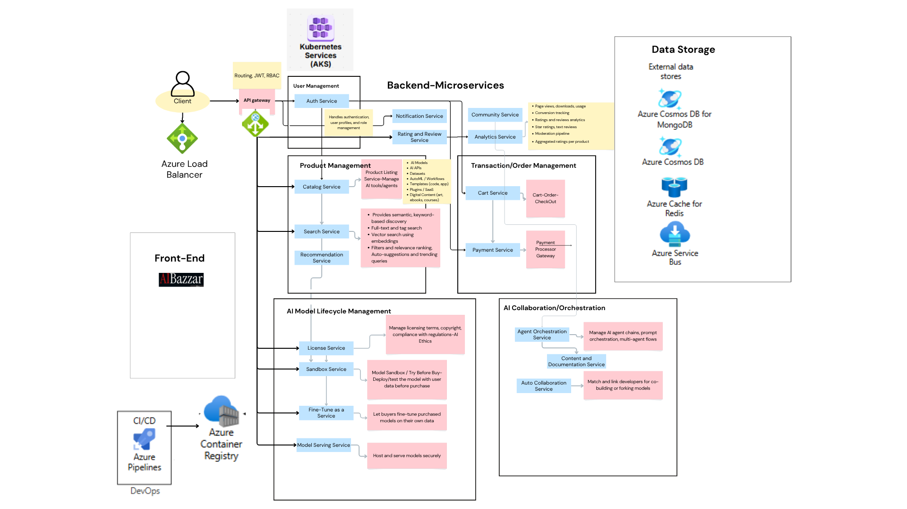

# AI Bazaar: Where AI Meets Microservices for Next-Gen Commerce

## Abstract

**AI Bazaar** is an AI microservices-powered marketplace that addresses the limitations of current AI marketplaces through intelligent automation, low-latency infrastructure, and continuous integration. The platform supports:

- Real-time AI asset deployment  
- Scalable inference services  
- Ethical monetization  

All powered by cloud-native and decentralized technologies.

## Problem Statement

How might we create a secure, user-friendly, and scalable online marketplace for AI models and services — where developers can monetize their AI products and businesses can easily discover, test, and deploy solutions tailored to their unique needs?
![AI Bazaar Microservices Chart(Client.png)

